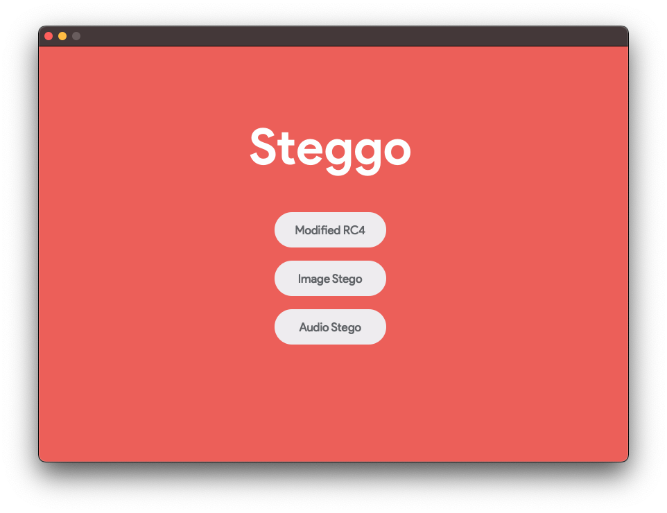
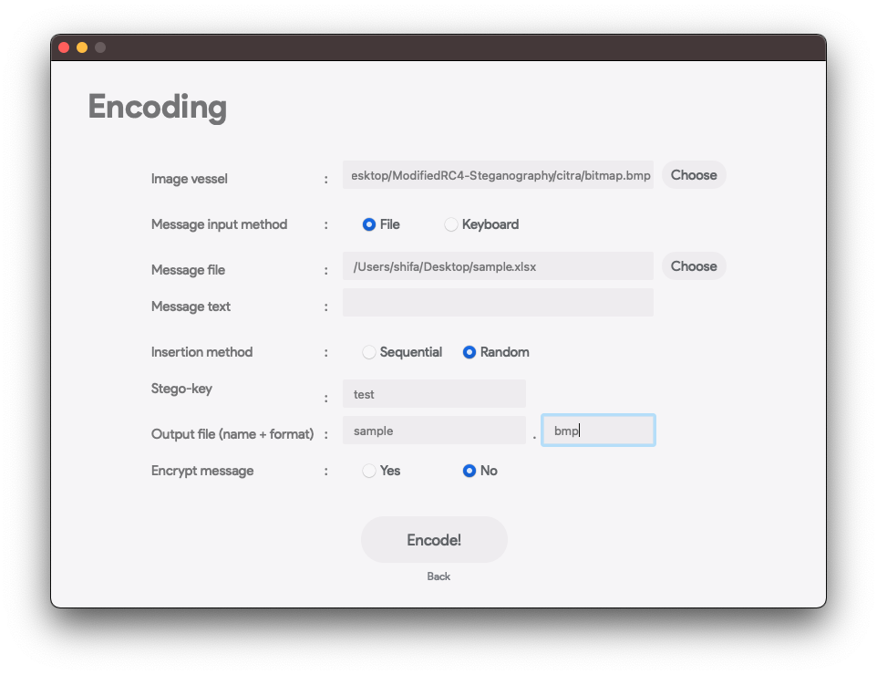
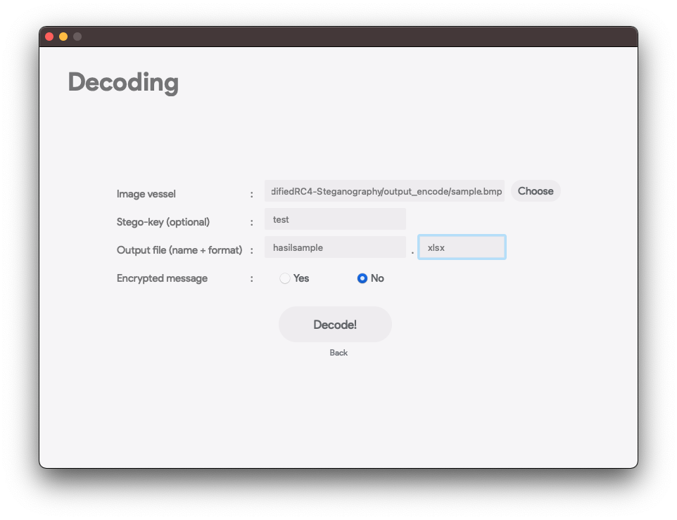
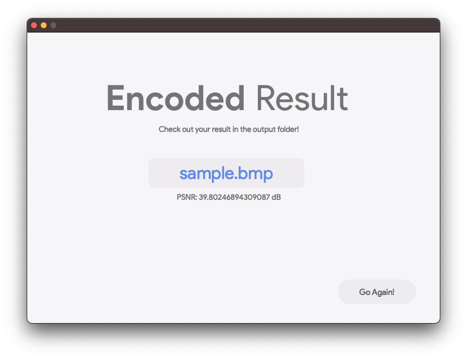
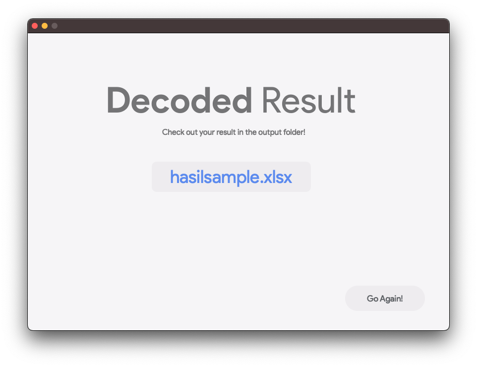

# ModifiedRC4-Steganography
## General info
Program ini dibuat untuk memenuhi tugas Mata Kuliah **IF 4020 Kriptografi** <br />

Program Studi Teknik Informatika <br />
Sekolah Teknik Elektro dan Informatika <br />
Institut Teknologi Bandung <br />

Semester I Tahun 2021/2022

## Algorithm
* Modified RC4
* Image & Audio Steganography using LSB

## Screenshots







## Technologies
* Python - version 3.8.3
* PyQt - version 5
* Numpy - version 1.18.5
* Wave - version 0.0.2
* Pillow - version 7.2.0
* Librosa - version 0.8.1

## Setup
```
  $pip3 install PyQt5
  $pip3 install numpy
  $pip3 install wave
  $pip3 install librosa
```

**Atau**, pada direktori project, setup virtual environment dengan virtualenv.
```
virtualenv venv
.\venv\Scripts\activate
```
Lalu install dependencies yang tertera pada requirements.txt
```
pip install -r requirements.txt
```

## Executing The Program
```
  $python3 main2.py
```
## Features
* Encrypt-Decrypt text and file using modified RC4 Algorithm
* Encode-Decode text and file using Image and Audio Steganography
## Author
* Rexy Gamaliel R (13519010)
* Daru Bagus Dananjaya (13519080)
* Shifa Salsabiila (13519106)
